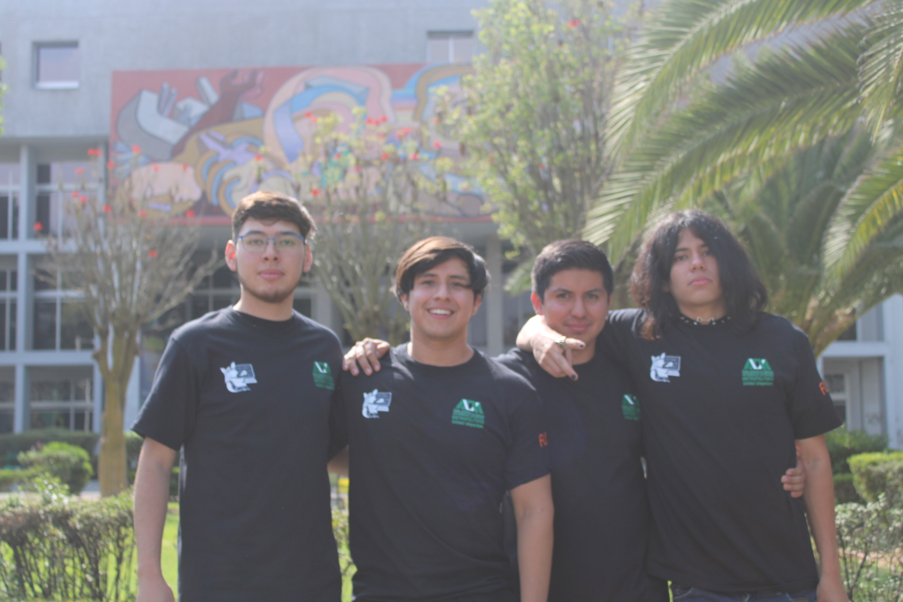

# Hackathon-ADMG

---

## Team members
- _Harold Camacho Herrera_ __(REP)__
- _Arturo Tom Ortiz_
- _Josue Mixalis García Carbajal_
- _Bryan Yafte Montiel Contreras_

    

> __We came as 1 of the 4 teams that represents our school "Universidad Autónoma Metropolitana" (Unidad Iztapalapa)__

   
---

## We are excited to present our project around the _"Financial Inclution"_ topic 

The main sight on this project is create a web app to bring some resources to rural zones people with no other goal that help them to improve their financial education and health.